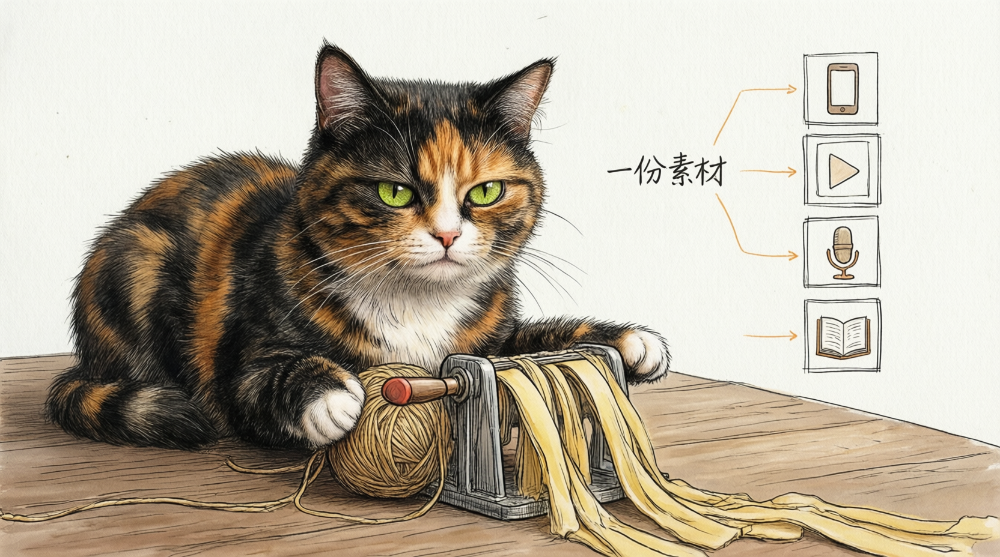
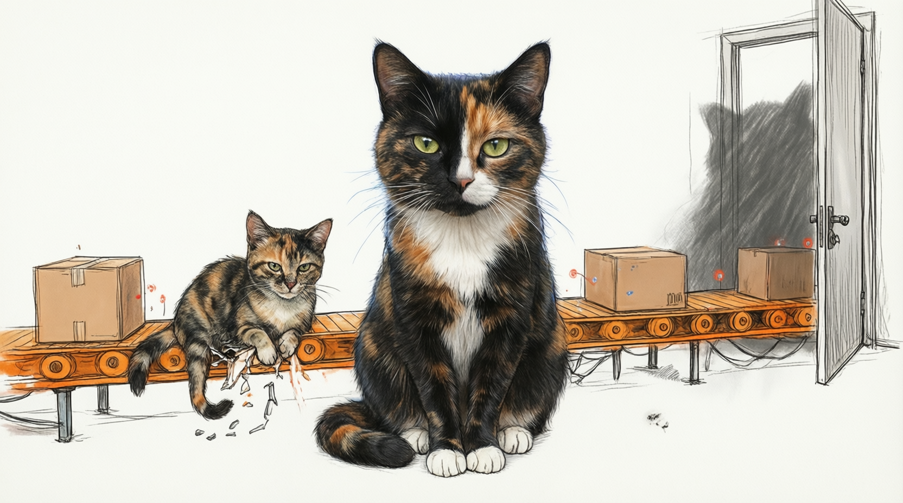

# Article Cat Illustrations

> 把中文文章里的判断、流程、状态和隐喻，变成一张张白底、手绘、怪诞但清爽的正文配图。
>
> 16:9 横版 | 三花猫 IP | 纯白手绘 | 少量红橙蓝中文批注 | Codex Skill

---

## 这个仓库是什么

Article Cat Illustrations 是一个 Codex Skill，用来指导 AI Agent 为中文文章、帖子、博客、Notion 文档和方法论内容生成正文配图。

方法论改编自 [ian-xiaohei-illustrations](https://github.com/helloianneo/ian-xiaohei-illustrations)（MIT），视觉 IP 从"小黑"替换为个人三花猫 IP：一只黑+橘棕+白三色毛、浅绿圆眼、永远冷淡脸的猫。猫不是萌宠、不是吉祥物，而是一只正在认真参与系统运转的"工牌猫"——严肃、冷静，但干的活有点荒诞。

与原版的一个重要区别：**生图不再依赖内置 `image_gen`，而是通过 qiyuan-image 技能（qwen-image API，qiyuanapi.cc 中转）完成**（`generate` 文生图 / `edit` 图生图），并且内置了针对 qwen-image 的实测调参经验。

一句话：**让 AI 不只是"配一张图"，而是把文章里的一个关键认知动作画出来，画面上干活的永远是这只三花猫。**

## 它会产出什么

- 16:9 横版正文配图（纯白背景、手绘线稿、少量红橙蓝中文批注）
- 一篇文章的 4-8 张 shot list：每张图的主题、核心意思、结构类型、猫的动作、中文标注建议
- 最终 PNG，保存到 workspace 的 `assets/<article-slug>-illustrations/`

## 示例效果

### 一鱼多吃



### 两个断点



示例只用于校准风格密度、留白和猫的参与方式，不是构图模板。

## 安装

前置：安装 `qiyuan-image` 技能（提供 `~/.codex/skills/qiyuan-image/qiyuan-image.mjs`），并在 `~/.codex/qiyuan.env` 或环境变量中配置 `QIYUAN_API_KEY`。

```bash
git clone https://github.com/nexsjournal/article-catimg-skill.git
mkdir -p "${CODEX_HOME:-$HOME/.codex}/skills"
cp -R ./article-cat-illustrations "${CODEX_HOME:-$HOME/.codex}/skills/"
```

## 怎么用

### 只做配图规划

```text
Use $article-cat-illustrations 先不要生图。
请分析下面这篇文章哪里值得配图，输出 5 张左右的 shot list。
每张图写清楚：放在哪段后、主题、核心意思、结构类型、猫在做什么、建议中文标注词。

<粘贴文章>
```

### 直接生成正文配图

```text
Use $article-cat-illustrations 把下面这篇文章生成 4 张三花猫怪诞正文配图。
要求：16:9 横版、纯白背景、手绘线稿、少量红橙蓝中文手写批注。

<粘贴文章>
```

### 为单个概念生成一张图

```text
Use $article-cat-illustrations 为"信任不是喊出来的，而是一块证据一块证据铺过去"生成一张正文配图。
画面要怪诞但清爽，猫必须承担核心动作。
```

## 目录结构

```text
.
├── README.md
├── LICENSE
├── NOTICE.md
├── examples/
│   └── images/
└── article-cat-illustrations/   # 真正需要安装到 Codex 的子目录
    ├── SKILL.md
    ├── agents/openai.yaml
    ├── assets/
    │   ├── cat/                  # 三花猫参考照（角色一致性用）
    │   └── examples/             # 风格校准样例（来自原版，低频使用）
    └── references/
        ├── style-dna.md
        ├── cat-ip.md
        ├── composition-patterns.md
        ├── prompt-template.md
        └── qa-checklist.md
```

## 注意事项

- 图片里的中文文字越短越稳定；qwen-image 有重复标注的倾向，模板里已内置防重复约束。
- 猫必须承担核心动作；如果去掉猫画面仍然完全成立，说明猫太装饰了。
- 毛色必须黑+橘棕+白三花、眼睛浅绿；跑偏时用 `edit` 命令以 `assets/cat/cat-01.png` 为参考图重做。
- 不要把 `QIYUAN_API_KEY` 写进仓库。

## License

MIT License. See [LICENSE](LICENSE). 方法论参考 [ian-xiaohei-illustrations](https://github.com/helloianneo/ian-xiaohei-illustrations)（MIT），见 [NOTICE.md](NOTICE.md)。
